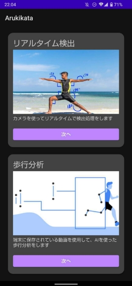
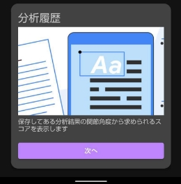
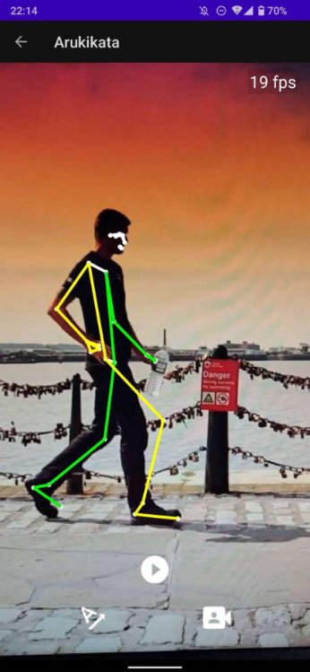
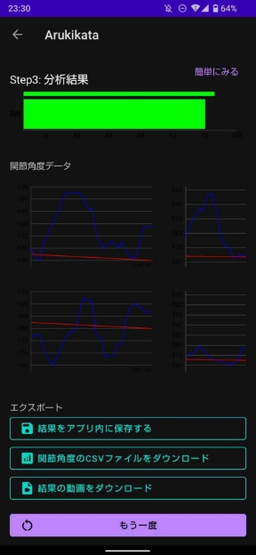
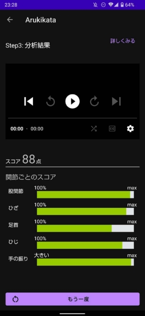
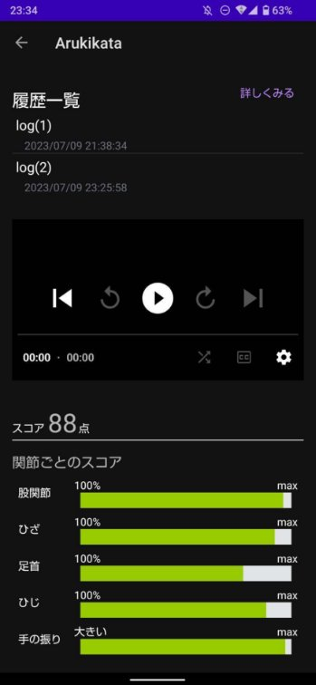

# アプリケーション紹介資料

このアプリは主に高齢者向けに作られたアプリで、リアルタイムで姿勢推定や動画からの歩行分析ができます。マーカーレスで無料であり、一般の人々にも使いやすいアプリケーションを目指しました。

## ホーム画面  
・リアルタイム検出  
カメラを使用してマーカーレスで姿勢推定を行う。

・歩行分析  
新たに撮影した動画又は端末に保存されている動画を使用して歩行分析を行う。

・分析履歴  
保存された分析結果やスコアを表示し、過去の歩行分析結果が確認できる。

  

## リアルタイム検出  
・フレームレートの表示  

・姿勢推定  
マーカーレスで姿勢推定を行う。 

・動画の撮影

・検出の有無

・関節角度の表示

## 歩行分析 
・動画の撮影もしくは選択  

・棒グラフや線グラフの表示

・結果の保存、エクスポート

・分析結果の表示 

 

## 分析履歴 
・履歴の表示  

・スコアを部位ごとで分かりやすく

  

